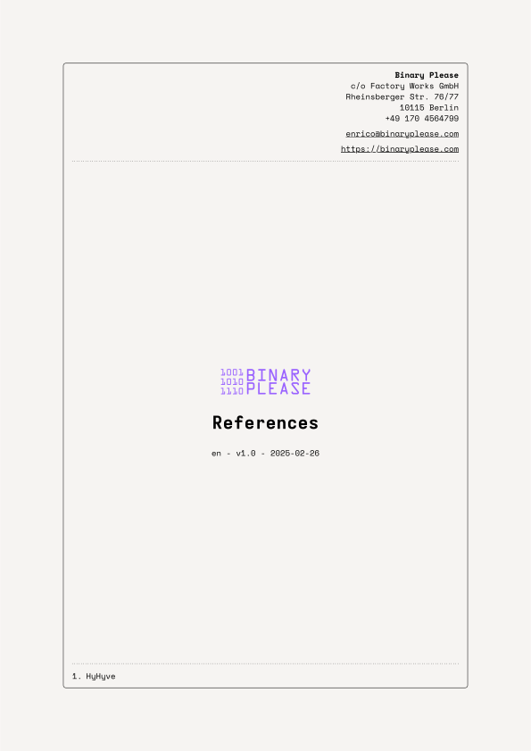

# References Typst Template

<a href="./images/sample.pdf">
  <p align="center">
  
   
  </p>
</a>

<p align="center">
  <a href="./images/sample.pdf">
  Example PDF
  </a>
</p>

---


This is a Typst template designed for creating professional reference documents, particularly useful for tender applications.

## Features

*   **YAML Data Source:** Uses YAML files to manage and populate reference data, making it easy to update and maintain information.
*   **Multi-Language Support:**  Supports both English (EN) and German (DE) languages.

## Getting Started

1.  **Initialize the Project:**

    Use the following command to copy the template files into your project directory:

    ```bash
    just init
    ```

2.  **Build the Document:**

    Build the reference document for your desired language using the following command. The default language is English if none is specified.

    ```bash
    just build en # (or de)
    ```

## Language Server Protocol (LSP) Configuration (Optional)

To set the default language for the Typst LSP in your workspace, add the following configuration to your workspace settings (e.g., `.vscode/settings.json` in VS Code):

```jsonc
{
  "tinymist.typstExtraArgs": [
    "--input",
    "lang=de" // or "lang=en" for English as default
  ]
}